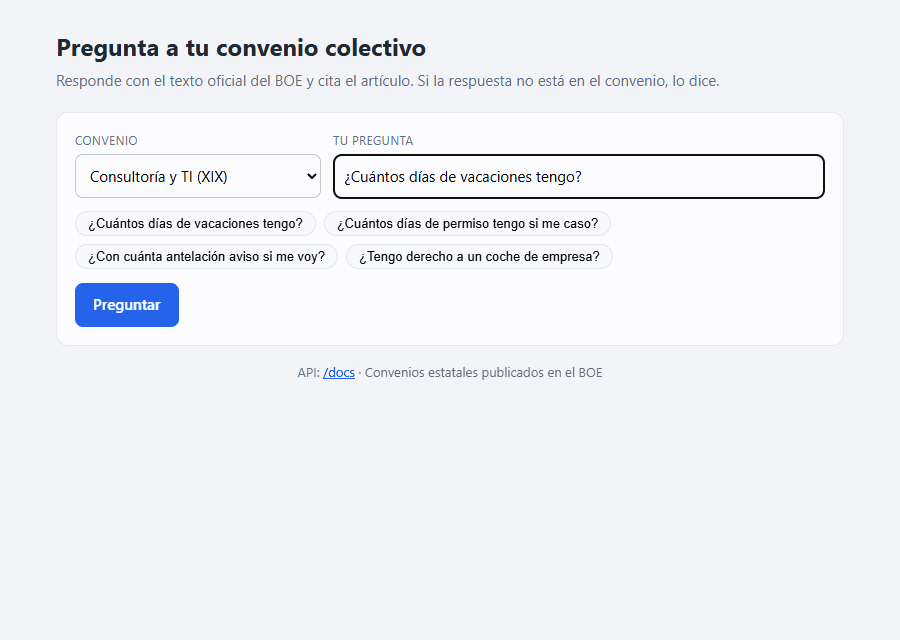

# Pregunta a tu convenio colectivo

**EN** · Ask questions about Spanish collective labour agreements in plain language and get a short answer that cites the exact article, or an honest "it is not in the agreement".

Para trabajadores y pequeñas empresas que necesitan una respuesta concreta ("¿cuántos días de vacaciones tengo?") en un convenio del BOE de más de 100 páginas.

## Qué hace
- Responde en lenguaje llano a preguntas sobre convenios colectivos estatales publicados en el BOE
- Cita siempre el convenio y el artículo de donde sale la respuesta
- Si la respuesta no está en el convenio, lo dice en lugar de inventarla

## Resultado
- **Acierta 29 de 30 preguntas** y cita el artículo correcto, en poco más de un segundo cada una
- **Reconoce las 5 preguntas trampa** cuya respuesta no está en el convenio, y **no dio ninguna respuesta equivocada**

Examen con 30 preguntas escritas a mano y 5 trampa sobre dos convenios estatales del BOE · modelo gpt-4.1-mini · 28/09/2026 · [detalle](docs/TECNICO.md#evaluación)

## Tecnologías
Python · FastAPI · IA (RAG) · PostgreSQL + pgvector · Docker · GitHub Actions

## Mi papel
Lo he diseñado y desarrollado de principio a fin. Desarrollo asistido por IA bajo mi especificación y revisión.

[Detalles técnicos →](docs/TECNICO.md) · [LinkedIn](https://www.linkedin.com/in/miquel-moreno-martinez)
